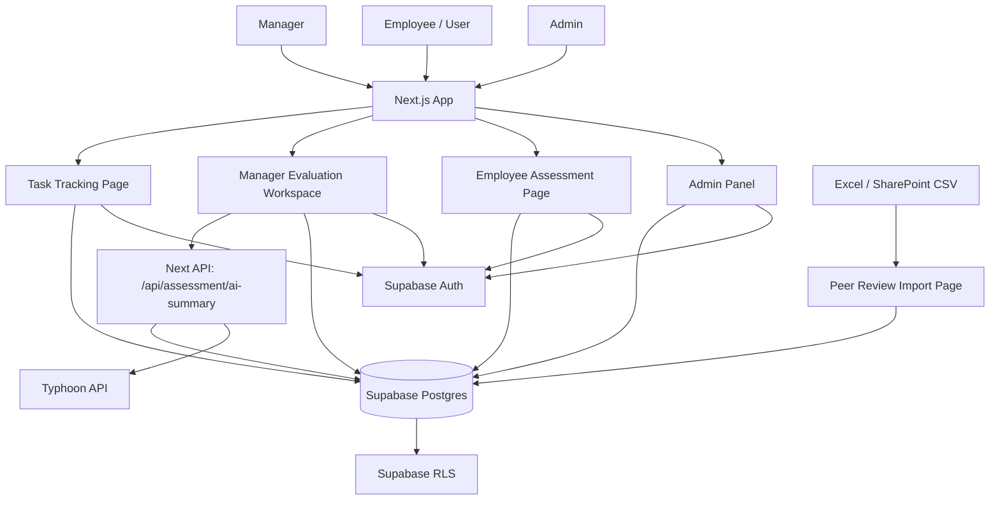
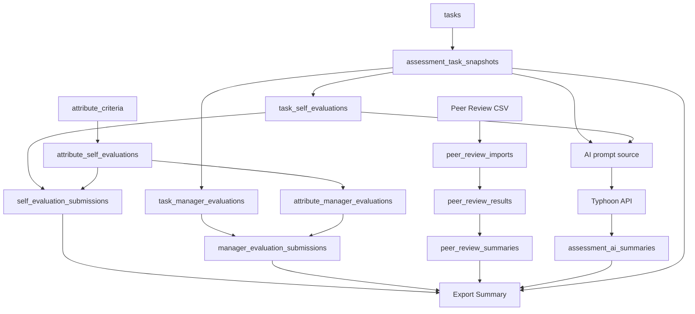
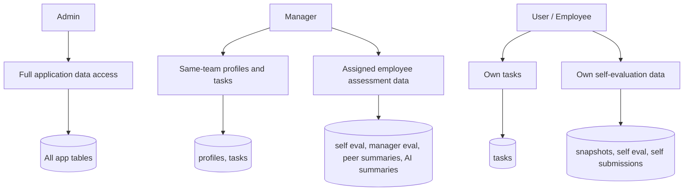

# System Architecture

This document describes the technical architecture of the Task Tracking and Staff Performance Assessment app.

## High-Level Architecture

## Evaluation Workflow

```mermaid
flowchart LR
  A[Admin setup assessment period] --> B[Prepare tasks and weights]
  B --> C[Sync assessment task snapshots]
  C --> D[Assign managers]
  D --> E[Employee self-evaluation]
  E --> F[Admin imports peer review CSV]
  F --> G[Generate AI summary]
  G --> H[Manager evaluation]
  H --> I[Admin oversight / return if needed]
  I --> J[Export summary CSV]
```

## Data Flow

## Role Access

## Runtime Components

| Layer | Implementation | Notes |
| --- | --- | --- |
| Frontend | Next.js App Router under `app/` | Most pages are client components using Supabase browser client |
| Shared UI | `components/` | App shell, task modal, Gantt chart, peer insight panel |
| Data client | `utils/supabase.ts` | Uses `NEXT_PUBLIC_SUPABASE_URL` and `NEXT_PUBLIC_SUPABASE_ANON_KEY` |
| Business logic | `utils/scoring.ts`, `utils/taskProgress.ts`, `utils/evaluationTasks.ts` | Scoring and task hierarchy helpers |
| Import logic | `utils/peerReview.ts` | CSV template, parser, validation, summary builder |
| AI logic | `utils/aiSummary.ts`, `app/api/assessment/ai-summary/route.ts` | Prompt building and server-only Typhoon call |
| Database | Supabase Postgres | Migrations in `supabase/migrations/` |
| Security | Supabase Auth and RLS | Phase 7B migration is draft until manually applied |

## Important Architectural Decisions

- `profiles.id = auth.uid()`.
- `employee_id = profiles.display_name`.
- `tasks.assignee = profiles.display_name`.
- Roles are `admin`, `manager`, `user`.
- `user` means employee/staff.
- No `team_members` table is currently used; team context uses `profiles.team_id`.
- Manager task/profile context is team-based.
- Manager evaluation authority is assignment-based through `manager_evaluation_assignments`.
- AI summary is stored and displayed as reference context only.

